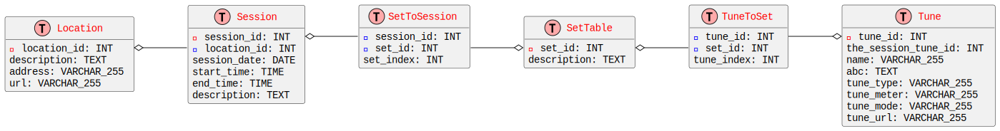

# Session Tunes

## Use Cases
1. Identify tunes to learn
1. Search for tunes based on tune characteristics
1. Enable practicing tunes by playing multiple tunes as a set
1. Create a version that will work seamlessly on mobile
1. Be able to recognize tunes
1. Suggest chords for a tune
1. Process audio input in real time
1. Allow for exporting tunes in many file formats (abc, MusicXml)
1. Define sessions by name and location
1. Update session data live using wave file (autorecognition)
1. Interface for building a set of tunes

## Development Environment

Install [node.js](https://nodejs.org/en) with all dependencies.<br>
Change directories into the root of this repo on your local.<br>

To use the relational database, install sqlite on the server.
```
npm i express sqlite3
```

To use the graph database, install neoj4 on the server.
```
npm install neo4j-driver
```

Start the server.
```
npm run start
```
Use Ctrl-c to stop the server and restart if you changed any js.


## Relational Database
The schema used for the relational database can be visualized with this diagram.


After prototyping the website using this schema observable lag was seen even for one user.
This illustrates a need for some other way of generating the reports.

This relational database is also not suited to filtering the counts by date range.

## Graph Database
Currently working to create a schema.
The neo4j database is hosted on neo4j+s://a36f2166.databases.neo4j.io
